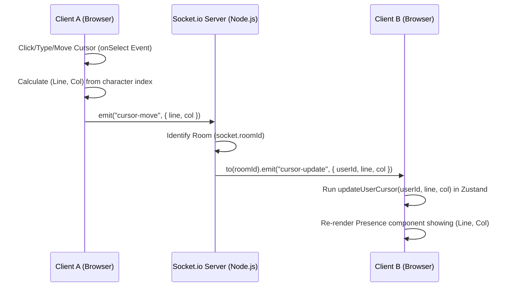

# Real-Time Cursor Tracking Workflow

This document details the architecture, math, network events, and state synchronization flow for tracking other active users' cursor positions (Line and Column) in real-time.

---

## 1. System Architecture

The cursor tracking system uses an event-driven flow linking the client DOM, the Zustand state store, and the custom Socket.io server.



---

## 2. Step-by-Step Lifecycle

### Step 1: Cursor Movement (Client-Side Trigger)
In a standard HTML `<textarea>`, cursor movement happens when a user types, clicks with the mouse, or navigates with the arrow keys. 
In React, we hook into the **`onSelect`** event handler of the textarea. This event fires for *all* selection and caret position modifications.

### Step 2: Caret Position Mathematics
Since the browser's `<textarea>` caret position is stored as a single, absolute character index (`selectionStart`), we translate it into a readable grid coordinate `(Line, Column)`:

1.  **Extract Text up to Caret:** Get a substring from index `0` to the caret index (`selectionStart`):
    ```typescript
    const textUpToCursor = textarea.value.substring(0, textarea.selectionStart);
    ```
2.  **Calculate Line Number:** Split the substring by newline characters (`\n`). The length of the resulting array is the current line number:
    ```typescript
    const lines = textUpToCursor.split('\n');
    const line = lines.length;
    ```
3.  **Calculate Column Number:** The length of the last string element in that array represent the characters on the current line. We add `1` to get the column caret position:
    ```typescript
    const col = lines[lines.length - 1].length + 1;
    ```

### Step 3: Network Event Emitters

#### A. Client sends to Server
Once coordinates are calculated, the client sends a `cursor-move` message over the WebSocket connection:
```typescript
socket.emit('cursor-move', { line, col });
```

#### B. Server Broadcasts to the Room
The custom Node.js server (`server.js`) listens for `'cursor-move'`. 
Using the `socket.roomId` attached to the socket on connection, the server broadcasts the event only to **other** sockets in the same room using `.to(roomId)`:
```javascript
socket.on('cursor-move', (data) => {
  if (socket.roomId) {
    socket.to(socket.roomId).emit('cursor-update', {
      userId: socket.id,
      line: data.line,
      col: data.col,
    });
  }
});
```

### Step 4: Client Listener & Zustand Update
Other clients in the room receive the `'cursor-update'` event in `SocketListener.tsx`:
```typescript
socket.on('cursor-update', ({ userId, line, col }) => {
  updateUserCursor(userId, line, col);
});
```
This runs the Zustand action `updateUserCursor`. It maps through the active `users` array in memory, matches the `userId`, and updates their `cursor` coordinates.

### Step 5: UI Rendering
The `Presence.tsx` component is bound to the Zustand `users` state. It re-renders automatically:
```tsx
{users.map((user) => (
  <span key={user.id} style={{ color: user.color }}>
    {user.name} 
    {user.cursor && ` (L:${user.cursor.line}, C:${user.cursor.col})`}
  </span>
))}
```
When a user moves their cursor, their coordinates instantly render in their assigned color in the header. When they disconnect, the socket cleanup removes them entirely.
