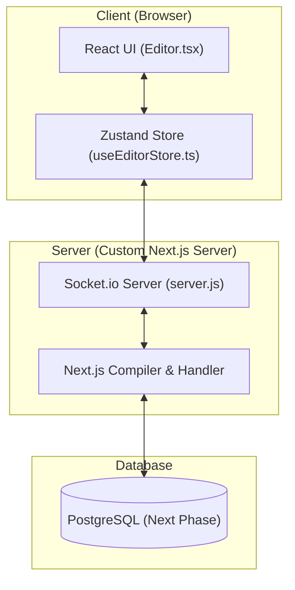
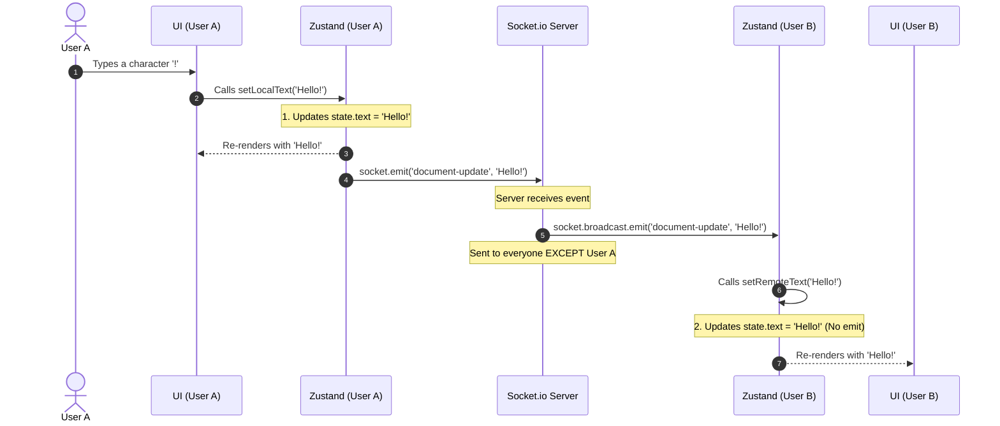

# Real-Time Collaborative Markdown Editor: MVP Architecture

This document explains the conceptual model, architecture, and event lifecycle of the Minimum Viable Product (MVP) real-time collaborative markdown editor.

---

## 1. High-Level Architecture

The application is built as a unified Next.js project utilizing a custom Node.js HTTP server. This architecture supports both standard server-side rendering (SSR) / API routes and long-lived WebSocket connections.

---

## 2. State Synchronization & The "Echo Loop" Solution

To keep the editing experience fast and fluid, the editor uses **Optimistic Updates** (Last-Write-Wins). 

When User A types, their local UI updates instantly without waiting for a server confirmation. The change is then broadcasted to all other users.

### The Infinite Loop Problem:
If we trigger a socket broadcast on *every* state update, then User B receiving a remote update will update their state, which would then trigger another broadcast back to the server, creating an infinite ping-pong loop.

### The Solution:
We split the state mutations into two distinct actions with different side-effect profiles:

1.  **`setLocalText(newText)`** (Triggered by local typing):
    *   Updates the local Zustand state.
    *   Emits a `document-update` event to the WebSocket server.
2.  **`setRemoteText(newText)`** (Triggered by incoming WebSocket events):
    *   Updates the local Zustand state.
    *   **Does not** emit any WebSocket events.

---

## 3. Step-by-Step Data Flow (Keypress Lifecycle)

Below is the sequence of events that occurs when **User A** types a character, and it synchronizes to **User B**.

---

## 4. Connection Lifecycle (Headless Listener Pattern)

We use a **Headless React Component** (`SocketListener.tsx`) to manage the connection. This component renders nothing (`return null`) but controls the side-effect lifecycle:

*   **Mounting:** When the page loads, it attaches listeners (`connect`, `disconnect`, `document-update`) to the global socket singleton, then calls `socket.connect()`.
*   **Unmounting (Cleanup):** When the user leaves, it detaches all listeners using `socket.off(...)` and calls `socket.disconnect()`. This prevents **memory leaks** and **multiple listener accumulation** on page hot-reloads.
